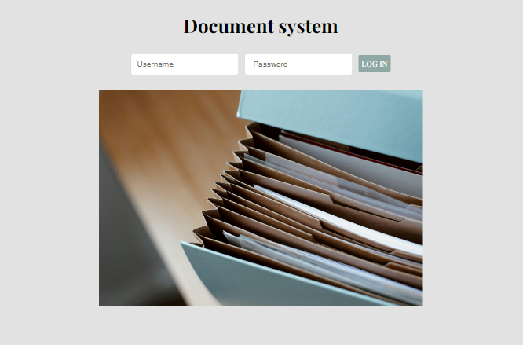
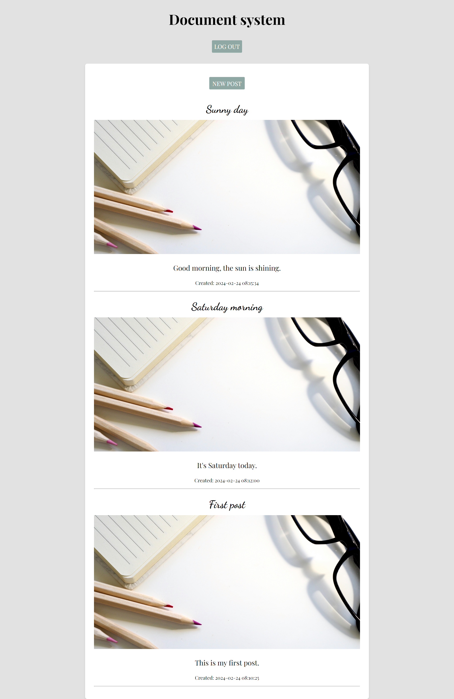
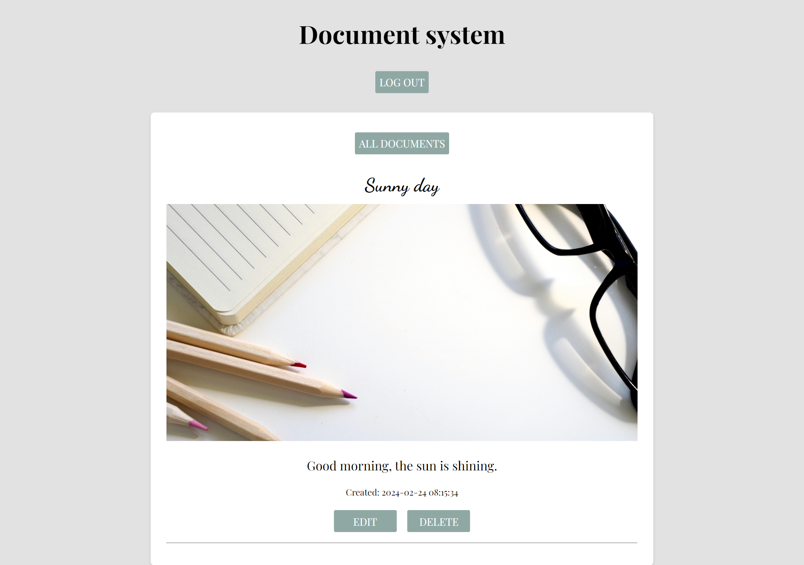
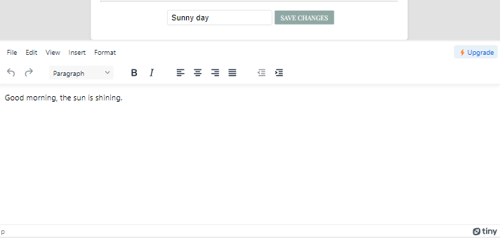

# DOCUMENT SYSTEM

## 📄 About The Project 
This project is a web application that allows registered users to log in, view their documents (blog posts), create new ones, delete, and edit existing documents. The backend of the application is powered by Node.js and Express, with data stored in a MySQL database using phpMyAdmin. The frontend utilizes HTML, CSS, and JavaScript, with the TinyMCE library for a rich text editor.

## 📁 Project Structure

The project is organized into two main directories:

- `backend`: Contains the server-side logic built with Node.js and Express.
- `frontend`: Houses the client-side code with HTML, CSS, and JavaScript.

Additionally, there is a `mock-data` directory that includes sample data for testing purposes.

Feel free to explore each directory for more details on the specific files and components.

## ⚙️ How to run the project
### 1. Clone the repository
### 2. npm install
### 3. npm start / nodemon start
Import mock data from the "mock-data" folder in the root of the project.

## 📂 Database Dump

For testing purposes, a sample database dump is included in the `mock-data` directory. To import the data into your MySQL database, follow these steps:

1. Open phpMyAdmin and create a new database.
2. Select the newly created database.
3. Choose the 'Import' tab.
4. Upload the provided SQL dump file.
5. Click 'Go' to execute the import.

## 👨🏻‍💻 Tech Stack
### Backend

### Database

### Frontend

## 📷 Screenshots

## Created by

#### Published: 2024